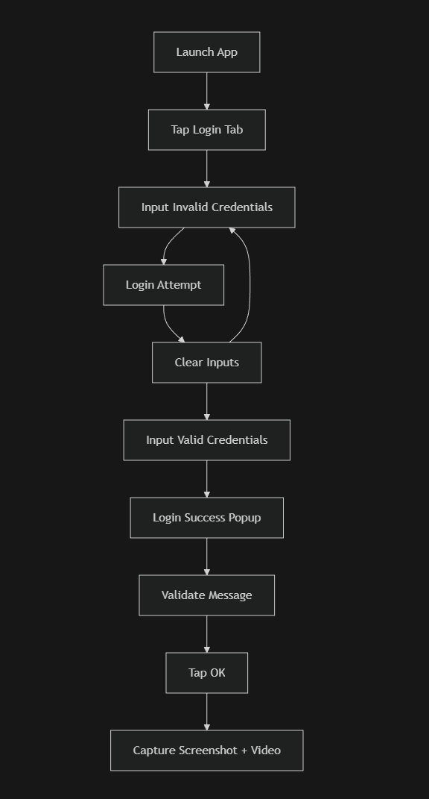

# Part 4 – Comprehensive Documentation  
QA Automation Assessment  

Author: Fakhri Aria Fadhlillah  

---

## 1. Executive Summary

### a. What was tested across all three platforms

This assessment covers automation testing across three layers:

### Web Application Testing (Playwright)
- Product browsing
- Add to cart
- Checkout process
- Order confirmation validation

### API / Backend Testing
- REST API positive and negative scenarios
- Status code validation
- Response body verification
- Error handling

### Mobile Application Testing (WebdriverIO + Appium)
- Login flow (invalid → valid)
- Forms interaction
- Dropdown handling
- Mobile gestures (scroll & swipe)
- UI popup validation
- Media capture (screenshots + video)

---

### b. Overall Test Results Summary

| Platform | Result |
|----------|--------|
| Web | ✅ Passed |
| API | ✅ Passed |
| Mobile | ✅ Passed |

All core flows executed successfully with assertions for functional correctness and UI behavior.

---

### c. Key Findings and Insights

- Page Object Model improves maintainability and readability.
- Resource-id and Accessibility ID provide the most stable mobile locators.
- Mobile gestures must be calculated dynamically based on screen size.
- Centralized utility functions simplify screenshot and recording handling.
- Explicit waits are required for dynamic elements such as dropdowns and dialogs.

---

## 2. AI Tools Usage Report

### a. AI tools used

- ChatGPT

---

### b. How AI accelerated the testing process

AI was used to assist with:

- Understanding error messages
- Debugging automation failures
- Refining gesture logic
- Structuring Page Object Model
- Formatting documentation

This helped reduce troubleshooting time and improved implementation clarity.

---

### c. Examples of AI-assisted areas

- Swipe and scroll coordinate calculation
- Retry login strategy
- Utility abstraction for screenshots and recordings
- Mermaid flow diagram formatting

All automation logic and test scenarios were implemented manually.

---

### d. Pros and Cons of using AI in test automation

#### Pros:
- Faster debugging
- Reduced boilerplate coding
- Improved documentation structure
- Learning accelerator

#### Cons:
- Requires manual validation
- May suggest outdated syntax
- Cannot replace engineering judgment
- Needs domain knowledge to apply correctly

AI was used strictly as a productivity assistant.

---

## 3. Test Flow Diagram (Mobile Login Scenario)

This diagram illustrates:

- Invalid login retries
- Successful authentication
- Forms interaction
- Gesture testing
- Screenshot and video recording

---

## 4. Edge Cases & Quality Insights

### Identified Edge Cases

1. Mobile loses network during login
2. Empty shopping cart during checkout
3. API returns 500 Internal Server Error
4. User submits empty form fields
5. Dropdown options fail to load
6. Rapid multiple login taps
7. Popup dismissed before validation

---

### Proposed Testing Approach

| Edge Case | Test Method |
|-----------|-------------|
| Network loss | Toggle airplane mode |
| Empty cart | Negative checkout validation |
| API 500 | Mock backend response |
| Empty inputs | Field validation |
| Dropdown failure | Retry + assertion |
| Rapid taps | Stress interaction |
| Popup dismissal | Forced close and retry |

---

## 5. Scalability Strategy (Bonus)

### a. Scaling to 100+ test cases

- Modular Page Object Model
- Data-driven testing
- Test tagging (@smoke, @regression)
- Parallel execution
- Shared utilities

---

### b. Framework Suggestions

- Web: Playwright
- API: Playwright API / Axios
- Mobile: WebdriverIO + Appium

---

### c. CI/CD Integration Ideas

Recommended pipeline:

Commit → CI Trigger → Install Dependencies → Run Tests → Generate Reports → Upload Artifacts

Tools:

- GitHub Actions / GitLab CI
- Android Emulator in CI
- Screenshot & video artifacts

---

### d. Long-Term Maintenance Strategy

- Centralized locator management
- Utility abstraction
- Regression suite separation
- Regular refactoring
- Versioned test data
- Documentation updates

---

## Conclusion

This project demonstrates end-to-end QA automation across Web, API, and Mobile platforms.

The framework validates:

- Business flows
- Backend behavior
- Mobile UI interactions
- Gesture handling

The architecture is scalable and production-ready, following best practices such as Page Object Model and utility abstraction.

AI was used only as a support tool for debugging and documentation, while all test logic and implementation decisions were made independently.
