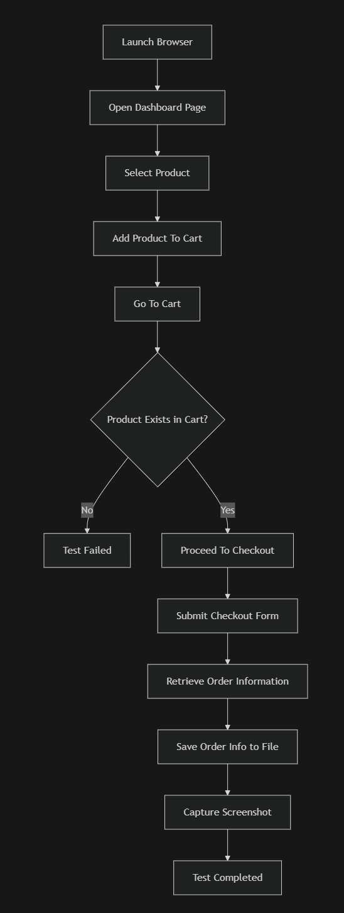

# Web Application Automation Testing – Demoblaze

## Overview

This project demonstrates an End-to-End automation testing flow for an e-commerce web application using Playwright and JavaScript.

Target application:
https://www.demoblaze.com

The automation covers the complete purchase journey, starting from product selection until successful checkout and order confirmation.

This project is structured using Page Object Model (POM) to improve maintainability and readability.

---

## Tools & Technologies

- Playwright
- JavaScript (ES Module)
- Node.js
- VS Code

---

## Test Scenario

### End to End Checkout Flow

1. Open Demoblaze homepage  
2. Select product (Samsung Galaxy S6)  
3. Add product to cart  
4. Navigate to cart  
5. Verify product exists in cart  
6. Proceed to checkout  
7. Fill customer information  
8. Complete purchase  
9. Capture Order ID  
10. Take screenshot for evidence  

---

Flow Diagram Web-testing (Web testing End to End)

---

## Project Structure

web-testing/
│
├── pageObject/
│ ├── DashboardPage.js
│ ├── ProductPage.js
│ └── CheckoutPage.js
│
├── tests/
│ └── e2eTest.spec.js
│
├── utils/
│ └── ToolsUtils.js
│
└── screenshots/
├── order-success.png
└── order-record.txt

---

## Automation Architecture

This project uses Page Object Model (POM):

- DashboardPage → homepage & product selection
- ProductPage → add to cart & navigation
- CheckoutPage → checkout form & confirmation
- ToolsUtils → screenshot and order logging

Each page logic is separated to improve scalability and maintenance.

---

## Evidence Generated

After execution:

### Screenshot > web-testing/screenshots/order-success.png

Run Test:
npx playwright test web-testing/tests/e2eTest.spec.js --headed

View HTML report:
npx playwright show-report

===================================================================

##AI Assistance
- ChatGPT was used only to assist with debugging and understanding error messages during development.
- All test scenarios, automation logic, Page Object Model structure, and validations were independently designed and implemented.

##Challenges Encountered
1. Playwright strict locator conflicts
 → Resolved by using role-based selectors

2. Dynamic UI elements
 → Handled with Playwright auto-wait mechanism

3. Order ID dynamic value
 → Captured via confirmation modal text

##Conclusion
This automation demonstrates a complete E2E purchase flow with:
- Structured Page Object Model
- Screenshot evidence
- Order ID logging
- Playwright reporting
The framework is scalable and can be extended for additional test scenarios such as negative cases, multiple products, and regression suites.

Author:
Fakhri Aria Fadhlillah
